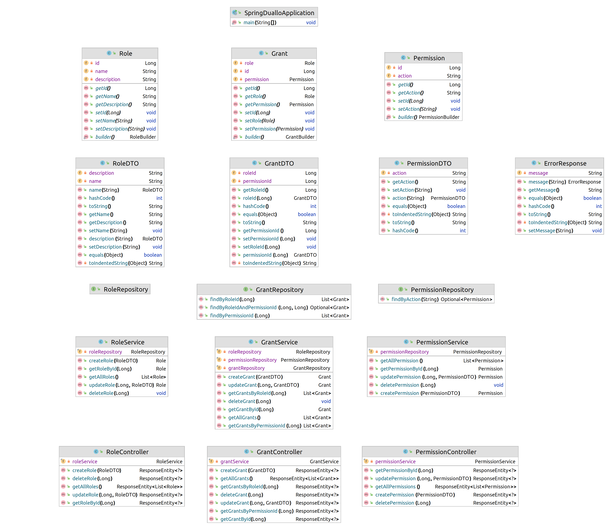

# Реалізація інформаційного та програмного забезпечення

## SQL-скрипт для створення на початкового наповнення бази даних

```mysql
-- MySQL Script generated by MySQL Workbench
-- Fri Oct 20 09:55:08 2023
-- Model: New Model    Version: 1.0
-- MySQL Workbench Forward Engineering

SET @OLD_UNIQUE_CHECKS=@@UNIQUE_CHECKS, UNIQUE_CHECKS=0;
SET @OLD_FOREIGN_KEY_CHECKS=@@FOREIGN_KEY_CHECKS, FOREIGN_KEY_CHECKS=0;
SET @OLD_SQL_MODE=@@SQL_MODE, SQL_MODE='ONLY_FULL_GROUP_BY,STRICT_TRANS_TABLES,NO_ZERO_IN_DATE,NO_ZERO_DATE,ERROR_FOR_DIVISION_BY_ZERO,NO_ENGINE_SUBSTITUTION';

-- -----------------------------------------------------
-- Schema db_coursework
-- -----------------------------------------------------
DROP SCHEMA IF EXISTS `db_coursework` ;

-- -----------------------------------------------------
-- Schema db_coursework
-- -----------------------------------------------------
CREATE SCHEMA IF NOT EXISTS `db_coursework` DEFAULT CHARACTER SET utf8 ;

USE `db_coursework` ;

-- -----------------------------------------------------
-- Table `db_coursework`.`Role`
-- -----------------------------------------------------
DROP TABLE IF EXISTS `db_coursework`.`Role` ;

CREATE TABLE IF NOT EXISTS `db_coursework`.`Role` (
  `id` INT NOT NULL AUTO_INCREMENT,
  `name` VARCHAR(45) NOT NULL,
  `description` VARCHAR(180) NULL DEFAULT NULL,
  PRIMARY KEY (`id`))
ENGINE = InnoDB;


-- -----------------------------------------------------
-- Table `db_coursework`.`Permission`
-- -----------------------------------------------------
DROP TABLE IF EXISTS `db_coursework`.`Permission` ;

CREATE TABLE IF NOT EXISTS `db_coursework`.`Permission` (
  `id` INT NOT NULL AUTO_INCREMENT,
  `action` VARCHAR(45) NOT NULL,
  PRIMARY KEY (`id`))
ENGINE = InnoDB;


-- -----------------------------------------------------
-- Table `db_coursework`.`Project`
-- -----------------------------------------------------
DROP TABLE IF EXISTS `db_coursework`.`Project` ;

CREATE TABLE IF NOT EXISTS `db_coursework`.`Project` (
  `id` INT NOT NULL AUTO_INCREMENT,
  `name` VARCHAR(45) NOT NULL,
  `description` VARCHAR(180) NULL DEFAULT NULL,
  PRIMARY KEY (`id`))
ENGINE = InnoDB;


-- -----------------------------------------------------
-- Table `db_coursework`.`Team`
-- -----------------------------------------------------
DROP TABLE IF EXISTS `db_coursework`.`Team` ;

CREATE TABLE IF NOT EXISTS `db_coursework`.`Team` (
  `id` INT NOT NULL,
  `name` VARCHAR(100) NULL,
  `motto` VARCHAR(255) NULL,
  `Project_id` INT NOT NULL,
  INDEX `fk_Team_Project1_idx` (`Project_id` ASC) VISIBLE,
  PRIMARY KEY (`id`),
  CONSTRAINT `fk_Team_Project1`
    FOREIGN KEY (`Project_id`)
    REFERENCES `db_coursework`.`Project` (`id`)
    ON DELETE NO ACTION
    ON UPDATE NO ACTION)
ENGINE = InnoDB;


-- -----------------------------------------------------
-- Table `db_coursework`.`User`
-- -----------------------------------------------------
DROP TABLE IF EXISTS `db_coursework`.`User` ;

CREATE TABLE IF NOT EXISTS `db_coursework`.`User` (
  `id` INT NOT NULL AUTO_INCREMENT,
  `nickname` VARCHAR(45) NOT NULL,
  `email` VARCHAR(45) NOT NULL,
  `password` VARCHAR(45) NOT NULL,
  `photo` VARCHAR(255) NULL DEFAULT NULL,
  `is_banned` TINYINT NOT NULL,
  PRIMARY KEY (`id`))
ENGINE = InnoDB;


-- -----------------------------------------------------
-- Table `db_coursework`.`Collaborator`
-- -----------------------------------------------------
DROP TABLE IF EXISTS `db_coursework`.`Collaborator` ;

CREATE TABLE IF NOT EXISTS `db_coursework`.`Collaborator` (
  `id` INT NOT NULL AUTO_INCREMENT,
  `Role_id` INT NOT NULL,
  `User_id` INT NOT NULL,
  `Team_id` INT NOT NULL,
  PRIMARY KEY (`id`),
  INDEX `fk_Member_Role1_idx` (`Role_id` ASC) VISIBLE,
  INDEX `fk_Member_User1_idx` (`User_id` ASC) VISIBLE,
  INDEX `fk_Collaborator_Team1_idx` (`Team_id` ASC) VISIBLE,
  CONSTRAINT `fk_Member_Role1`
    FOREIGN KEY (`Role_id`)
    REFERENCES `db_coursework`.`Role` (`id`)
    ON DELETE NO ACTION
    ON UPDATE NO ACTION,
  CONSTRAINT `fk_Member_User1`
    FOREIGN KEY (`User_id`)
    REFERENCES `db_coursework`.`User` (`id`)
    ON DELETE NO ACTION
    ON UPDATE NO ACTION,
  CONSTRAINT `fk_Collaborator_Team1`
    FOREIGN KEY (`Team_id`)
    REFERENCES `db_coursework`.`Team` (`id`)
    ON DELETE NO ACTION
    ON UPDATE NO ACTION)
ENGINE = InnoDB;


-- -----------------------------------------------------
-- Table `db_coursework`.`Sprint`
-- -----------------------------------------------------
DROP TABLE IF EXISTS `db_coursework`.`Sprint` ;

CREATE TABLE IF NOT EXISTS `db_coursework`.`Sprint` (
  `id` INT NOT NULL AUTO_INCREMENT,
  `name` VARCHAR(45) NOT NULL,
  `goal` VARCHAR(100) NOT NULL,
  `startdate` DATETIME NULL DEFAULT NULL,
  `enddate` DATETIME NULL DEFAULT NULL,
  `Project_id` INT NOT NULL,
  PRIMARY KEY (`id`),
  INDEX `fk_Sprint_Project1_idx` (`Project_id` ASC) VISIBLE,
  CONSTRAINT `fk_Sprint_Project1`
    FOREIGN KEY (`Project_id`)
    REFERENCES `db_coursework`.`Project` (`id`)
    ON DELETE NO ACTION
    ON UPDATE NO ACTION)
ENGINE = InnoDB;


-- -----------------------------------------------------
-- Table `db_coursework`.`Tag`
-- -----------------------------------------------------
DROP TABLE IF EXISTS `db_coursework`.`Tag` ;

CREATE TABLE IF NOT EXISTS `db_coursework`.`Tag` (
  `id` INT NOT NULL AUTO_INCREMENT,
  `name` VARCHAR(45) NOT NULL,
  `description` VARCHAR(180) NULL DEFAULT NULL,
  PRIMARY KEY (`id`))
ENGINE = InnoDB;


-- -----------------------------------------------------
-- Table `db_coursework`.`Task`
-- -----------------------------------------------------
DROP TABLE IF EXISTS `db_coursework`.`Task` ;

CREATE TABLE IF NOT EXISTS `db_coursework`.`Task` (
  `id` INT NOT NULL AUTO_INCREMENT,
  `name` VARCHAR(45) NOT NULL,
  `description` VARCHAR(180) NULL DEFAULT NULL,
  `deadline` DATETIME NULL DEFAULT NULL,
  `creation_date` DATETIME NOT NULL,
  `Sprint_id` INT NULL DEFAULT NULL,
  PRIMARY KEY (`id`),
  INDEX `fk_Task_Sprint1_idx` (`Sprint_id` ASC) VISIBLE,
  CONSTRAINT `fk_Task_Sprint1`
    FOREIGN KEY (`Sprint_id`)
    REFERENCES `db_coursework`.`Sprint` (`id`)
    ON DELETE NO ACTION
    ON UPDATE NO ACTION)
ENGINE = InnoDB;


-- -----------------------------------------------------
-- Table `db_coursework`.`Assignment`
-- -----------------------------------------------------
DROP TABLE IF EXISTS `db_coursework`.`Assignment` ;

CREATE TABLE IF NOT EXISTS `db_coursework`.`Assignment` (
  `id` INT NOT NULL AUTO_INCREMENT,
  `datatime` DATETIME NULL DEFAULT NULL,
  `Collaborator_id` INT NOT NULL,
  `Task_id` INT NOT NULL,
  PRIMARY KEY (`id`),
  INDEX `fk_Assignment_Member1_idx` (`Collaborator_id` ASC) VISIBLE,
  INDEX `fk_Assignment_Task1_idx` (`Task_id` ASC) VISIBLE,
  CONSTRAINT `fk_Assignment_Member1`
    FOREIGN KEY (`Collaborator_id`)
    REFERENCES `db_coursework`.`Collaborator` (`id`)
    ON DELETE NO ACTION
    ON UPDATE NO ACTION,
  CONSTRAINT `fk_Assignment_Task1`
    FOREIGN KEY (`Task_id`)
    REFERENCES `db_coursework`.`Task` (`id`)
    ON DELETE NO ACTION
    ON UPDATE NO ACTION)
ENGINE = InnoDB;


-- -----------------------------------------------------
-- Table `db_coursework`.`Task_comment`
-- -----------------------------------------------------
DROP TABLE IF EXISTS `db_coursework`.`Task_comment` ;

CREATE TABLE IF NOT EXISTS `db_coursework`.`Task_comment` (
  `id` INT NOT NULL AUTO_INCREMENT,
  `subject` VARCHAR(45) NOT NULL,
  `text` VARCHAR(45) NOT NULL,
  `datetime` DATETIME NULL DEFAULT NULL,
  `Author_id` INT NOT NULL,
  `Task_id` INT NOT NULL,
  PRIMARY KEY (`id`),
  INDEX `fk_Task_comment_Member1_idx` (`Author_id` ASC) VISIBLE,
  INDEX `fk_Task_comment_Task1_idx` (`Task_id` ASC) VISIBLE,
  CONSTRAINT `fk_Task_comment_Member1`
    FOREIGN KEY (`Author_id`)
    REFERENCES `db_coursework`.`Collaborator` (`id`)
    ON DELETE NO ACTION
    ON UPDATE NO ACTION,
  CONSTRAINT `fk_Task_comment_Task1`
    FOREIGN KEY (`Task_id`)
    REFERENCES `db_coursework`.`Task` (`id`)
    ON DELETE NO ACTION
    ON UPDATE NO ACTION)
ENGINE = InnoDB;


-- -----------------------------------------------------
-- Table `db_coursework`.`Grant`
-- -----------------------------------------------------
DROP TABLE IF EXISTS `db_coursework`.`Grant` ;

CREATE TABLE IF NOT EXISTS `db_coursework`.`Grant` (
  `Role_id` INT NOT NULL,
  `Permission_id` INT NOT NULL,
  INDEX `fk_Grant_Role_idx` (`Role_id` ASC) VISIBLE,
  PRIMARY KEY (`Role_id`, `Permission_id`),
  INDEX `fk_Grant_Permission2_idx` (`Permission_id` ASC) VISIBLE,
  CONSTRAINT `fk_Grant_Role0`
    FOREIGN KEY (`Role_id`)
    REFERENCES `db_coursework`.`Role` (`id`)
    ON DELETE NO ACTION
    ON UPDATE NO ACTION,
  CONSTRAINT `fk_Grant_Permission2`
    FOREIGN KEY (`Permission_id`)
    REFERENCES `db_coursework`.`Permission` (`id`)
    ON DELETE NO ACTION
    ON UPDATE NO ACTION)
ENGINE = InnoDB;


-- -----------------------------------------------------
-- Table `db_coursework`.`Label`
-- -----------------------------------------------------
DROP TABLE IF EXISTS `db_coursework`.`Label` ;

CREATE TABLE IF NOT EXISTS `db_coursework`.`Label` (
  `Task_id` INT NOT NULL,
  `Tag_id` INT NOT NULL,
  PRIMARY KEY (`Task_id`, `Tag_id`),
  INDEX `fk_Label_Tag1_idx` (`Tag_id` ASC) VISIBLE,
  CONSTRAINT `fk_Label_Task1`
    FOREIGN KEY (`Task_id`)
    REFERENCES `db_coursework`.`Task` (`id`)
    ON DELETE NO ACTION
    ON UPDATE NO ACTION,
  CONSTRAINT `fk_Label_Tag1`
    FOREIGN KEY (`Tag_id`)
    REFERENCES `db_coursework`.`Tag` (`id`)
    ON DELETE NO ACTION
    ON UPDATE NO ACTION)
ENGINE = InnoDB;


-- -----------------------------------------------------
-- Table `db_coursework`.`Action`
-- -----------------------------------------------------
DROP TABLE IF EXISTS `db_coursework`.`Action` ;

CREATE TABLE IF NOT EXISTS `db_coursework`.`Action` (
  `date` DATETIME NULL DEFAULT NULL,
  `Sprint_id` INT NOT NULL,
  `Task_id` INT NOT NULL,
  `Assignment_id` INT NOT NULL,
  `Collaborator_id` INT NOT NULL,
  PRIMARY KEY (`Sprint_id`, `Task_id`, `Assignment_id`, `Collaborator_id`),
  INDEX `fk_Action_Task1_idx` (`Task_id` ASC) VISIBLE,
  INDEX `fk_Action_Assignment1_idx` (`Assignment_id` ASC) VISIBLE,
  INDEX `fk_Action_Collaborator1_idx` (`Collaborator_id` ASC) VISIBLE,
  CONSTRAINT `fk_Action_Sprint1`
    FOREIGN KEY (`Sprint_id`)
    REFERENCES `db_coursework`.`Sprint` (`id`)
    ON DELETE NO ACTION
    ON UPDATE NO ACTION,
  CONSTRAINT `fk_Action_Task1`
    FOREIGN KEY (`Task_id`)
    REFERENCES `db_coursework`.`Task` (`id`)
    ON DELETE NO ACTION
    ON UPDATE NO ACTION,
  CONSTRAINT `fk_Action_Assignment1`
    FOREIGN KEY (`Assignment_id`)
    REFERENCES `db_coursework`.`Assignment` (`id`)
    ON DELETE NO ACTION
    ON UPDATE NO ACTION,
  CONSTRAINT `fk_Action_Collaborator1`
    FOREIGN KEY (`Collaborator_id`)
    REFERENCES `db_coursework`.`Collaborator` (`id`)
    ON DELETE NO ACTION
    ON UPDATE NO ACTION)
ENGINE = InnoDB;


SET SQL_MODE=@OLD_SQL_MODE;
SET FOREIGN_KEY_CHECKS=@OLD_FOREIGN_KEY_CHECKS;
SET UNIQUE_CHECKS=@OLD_UNIQUE_CHECKS;


-- Додавання тестових даних


-- Початок транзакції
START TRANSACTION;

-- Додавання даних в таблицю `db_coursework`.`Permission`
INSERT INTO `db_coursework`.`Permission` (`action`)
VALUES
    -- collaborator
    ('EditUser'),
    ('CreateTask'),
    ('EditTask'),
    ('DeleteTask'),
    ('FilterTask'),
    ('CommentTask'),
    -- teamlead
    ('CreateProject'),
    ('DeleteProject'),
    ('CreateSprint'),
    ('FinishSprint'),
    ('AddMember'),
    ('DeleteMember'),
    -- admin
    ('UserSupport'),
    ('BanUser'),
    ('UnBanUser');


-- Додавання даних в таблицю `db_coursework`.`Role`
INSERT INTO `db_coursework`.`Role` (`name`, `description`)
VALUES
    ('Administrator', 'Administrator role'),
    ('Team-lead', 'Team-lead role'),
    ('Collaborator', 'Developer role');

-- Додавання даних в таблицю `db_coursework`.`Grant`
INSERT INTO `db_coursework`.`Grant` (`Role_id`, `Permission_id`)
VALUES
    (1, 1),
    (1, 2),
    (1, 3),
    (1, 4),
    (1, 5),
    (1, 6),
    (1, 7),
    (1, 8),
    (1, 9),
    (1, 10),
    (1, 11),
    (1, 12),
    (1, 13),
    (1, 14),
    (1, 15),

    (2, 1),
    (2, 2),
    (2, 3),
    (2, 4),
    (2, 5),
    (2, 6),
    (2, 7),
    (2, 8),
    (2, 9),
    (2, 10),
    (2, 11),
    (2, 12),

    (3, 1),
    (3, 2),
    (3, 3),
    (3, 4),
    (3, 5),
    (3, 6);


-- Додавання даних в таблицю `db_coursework`.`Project`
INSERT INTO `db_coursework`.`Project` (`name`, `description`)
VALUES
    ('Project 1', 'Description for Project 1'),
    ('Project 2', 'Description for Project 2');

-- Додавання даних в таблицю `db_coursework`.`Team`
INSERT INTO `db_coursework`.`Team` (`id`, `name`, `motto`, `Project_id`)
VALUES
    (1, 'Team 1', 'Motto for Team 1', 1),
    (2, 'Team 2', 'Motto for Team 2', 2);

-- Додавання даних в таблицю `db_coursework`.`User`
INSERT INTO `db_coursework`.`User` (`nickname`, `email`, `password`, `photo`, `is_banned`)
VALUES
    ('User1', 'user1@example.com', 'password1', 'link.com/photo', 0),
    ('User2', 'user2@example.com', 'password2', 'link.com/photo', 0);

-- Додавання даних в таблицю `db_coursework`.`Collaborator`
INSERT INTO `db_coursework`.`Collaborator` (`Role_id`, `User_id`, `Team_id`)
VALUES
    (1, 1, 1),  -- Admin User 1 in Team 1
    (2, 2, 2);  -- Manager User 2 in Team 2

-- Додавання тестових даних в таблицю `db_coursework.Sprint`
INSERT INTO `db_coursework`.`Sprint` (`name`, `goal`, `startdate`, `enddate`, `Project_id`)
VALUES
    ('Sprint 1', 'Complete Task 1', '2023-10-18 10:00:00', '2023-10-22 18:00:00', 1),
    ('Sprint 2', 'Finish Project 2', '2023-10-25 09:00:00', '2023-10-29 17:00:00', 2),
    ('Sprint 3', 'Implement Feature 3', '2023-11-01 08:00:00', '2023-11-05 16:00:00', 1);


-- Додавання даних в таблицю `db_coursework`.`Task`
INSERT INTO `db_coursework`.`Task` (`name`, `description`, `deadline`, `creation_date`, `Sprint_id`)
VALUES
    ('Task 1', 'Description for Task 1', '2023-10-31 12:00:00', NOW(), 1),
    ('Task 2', 'Description for Task 2', '2023-11-15 14:30:00', NOW(), 2),
    ('Task 3', 'Description for Task 3', '2023-11-20 10:00:00', NOW(), 3);

-- Додавання тестових даних в таблицю `db_coursework.Assignment`
INSERT INTO `db_coursework`.`Assignment` (`datatime`, `Collaborator_id`, `Task_id`)
VALUES
    ('2023-10-18 11:30:00', 1, 1),
    ('2023-10-19 14:15:00', 2, 2),
    ('2023-10-20 09:45:00', 1, 3);


COMMIT;

```

## RESTfull сервіс для управління даними

Цей RESTfull сервіс розроблений із застосуванням Spring Framework,  який забезпечує потужну підтримку для створення веб-додатків та сервісів.
Основними компонентами цього сервісу є:
- **Spring Boot** - спрощує конфігурацію та розгортання додатку, забезпечуючи вбудовану підтримку серверів застосунків.
- **Spring Data JPA** - використовується для взаємодії з базами даних через Java Persistence API (JPA). Він дозволяє легко створювати репозиторії для роботи з даними, автоматизуючи більшість CRUD операцій, що полегшує роботу з базою даних.
- **Swagger/OpenAPI** - використовується для документації цього RESTful API, надаючи зручний інтерфейс для тестування API та ознайомлення з його специфікацією. Це значно полегшує процес інтеграції та використання API іншими розробниками та сервісами.
- **Data Transfer Objects (DTO)** - згенеровані з OpenAPI специфікації, використовуються для безпечної передачі даних між різними шарами додатку. DTO допомагають уникнути зайвого викриття внутрішніх деталей моделей і підтримують чистоту API.

## Діаграма класів
<p>
    
</p>

На другому рівні схеми, **DTO** для **Role**, **Grant**, **Permission**, а також клас **ErrorResponse** згенеровані за допомогою **Swagger**.

## Project Management API Specification

```yaml
openapi: "3.0.0"
info:
  title: "Project Management API"
  version: "1.0.0"
  description: "API for managing project roles, grants, and permissions."

servers:
  - url: "http://localhost:8080/api"

paths:
  /roles:
    get:
      summary: "Get all roles"
      tags:
        - "Roles"
      responses:
        '200':
          description: "A list of roles"
          content:
            application/json:
              schema:
                type: array
                items:
                  $ref: '#/components/schemas/RoleDTO'
        '404':
          description: "Not Found"
          content:
            application/json:
              schema:
                $ref: '#/components/schemas/ErrorResponse'

    post:
      summary: "Create a role"
      tags:
        - "Roles"
      requestBody:
        required: true
        content:
          application/json:
            schema:
              $ref: '#/components/schemas/RoleDTO'
      responses:
        '201':
          description: "Role created"
          content:
            application/json:
              schema:
                $ref: '#/components/schemas/RoleDTO'
        '400':
          description: "Bad Request"
          content:
            application/json:
              schema:
                $ref: '#/components/schemas/ErrorResponse'
        '409':
          description: "Conflict"
          content:
            application/json:
              schema:
                $ref: '#/components/schemas/ErrorResponse'

  /roles/{roleId}:
    get:
      summary: "Get a role by ID"
      tags:
        - "Roles"
      parameters:
        - name: "roleId"
          in: "path"
          required: true
          schema:
            type: "integer"
      responses:
        '200':
          description: "A role object"
          content:
            application/json:
              schema:
                $ref: '#/components/schemas/RoleDTO'
        '404':
          description: "Role not found"
          content:
            application/json:
              schema:
                $ref: '#/components/schemas/ErrorResponse'

    put:
      summary: "Update a role"
      tags:
        - "Roles"
      parameters:
        - name: "roleId"
          in: "path"
          required: true
          schema:
            type: "integer"
      requestBody:
        required: true
        content:
          application/json:
            schema:
              $ref: '#/components/schemas/RoleDTO'
      responses:
        '200':
          description: "Role updated"
          content:
            application/json:
              schema:
                $ref: '#/components/schemas/RoleDTO'
        '400':
          description: "Bad Request"
          content:
            application/json:
              schema:
                $ref: '#/components/schemas/ErrorResponse'
        '404':
          description: "Role not found"
          content:
            application/json:
              schema:
                $ref: '#/components/schemas/ErrorResponse'

    delete:
      summary: "Delete a role"
      tags:
        - "Roles"
      parameters:
        - name: "roleId"
          in: "path"
          required: true
          schema:
            type: "integer"
      responses:
        '204':
          description: "Role deleted"
        '404':
          description: "Role not found"
          content:
            application/json:
              schema:
                $ref: '#/components/schemas/ErrorResponse'

  /grants:
    get:
      summary: "Get all grants"
      tags:
        - "Grants"
      responses:
        '200':
          description: "A list of grants."
          content:
            application/json:
              schema:
                type: array
                items:
                  $ref: '#/components/schemas/GrantDTO'
        '404':
          description: "Not Found"
          content:
            application/json:
              schema:
                $ref: '#/components/schemas/ErrorResponse'

    post:
      summary: "Create a grant"
      tags:
        - "Grants"
      requestBody:
        required: true
        content:
          application/json:
            schema:
              $ref: '#/components/schemas/GrantDTO'
      responses:
        '201':
          description: "Grant created"
          content:
            application/json:
              schema:
                $ref: '#/components/schemas/GrantDTO'
        '400':
          description: "Bad Request"
          content:
            application/json:
              schema:
                $ref: '#/components/schemas/ErrorResponse'
        '409':
          description: "Conflict"
          content:
            application/json:
              schema:
                $ref: '#/components/schemas/ErrorResponse'

  /grants/{grantId}:
    get:
      summary: "Get a grant by ID"
      tags:
        - "Grants"
      parameters:
        - name: "grantId"
          in: "path"
          required: true
          schema:
            type: "integer"
      responses:
        '200':
          description: "A grant object"
          content:
            application/json:
              schema:
                $ref: '#/components/schemas/GrantDTO'
        '404':
          description: "Grant not found"
          content:
            application/json:
              schema:
                $ref: '#/components/schemas/ErrorResponse'

    put:
      summary: "Update a grant"
      tags:
        - "Grants"
      parameters:
        - name: "grantId"
          in: "path"
          required: true
          schema:
            type: "integer"
      requestBody:
        required: true
        content:
          application/json:
            schema:
              $ref: '#/components/schemas/GrantDTO'
      responses:
        '200':
          description: "Grant updated"
          content:
            application/json:
              schema:
                $ref: '#/components/schemas/GrantDTO'
        '400':
          description: "Bad Request"
          content:
            application/json:
              schema:
                $ref: '#/components/schemas/ErrorResponse'
        '404':
          description: "Grant not found"
          content:
            application/json:
              schema:
                $ref: '#/components/schemas/ErrorResponse'

    delete:
      summary: "Delete a grant"
      tags:
        - "Grants"
      parameters:
        - name: "grantId"
          in: "path"
          required: true
          schema:
            type: "integer"
      responses:
        '204':
          description: "Grant deleted"
        '404':
          description: "Grant not found"
          content:
            application/json:
              schema:
                $ref: '#/components/schemas/ErrorResponse'

  /grants/by-role/{roleId}:
    get:
      summary: "Get grants by role ID"
      tags:
        - "Grants"
      parameters:
        - name: "roleId"
          in: "path"
          required: true
          schema:
            type: "integer"
      responses:
        '200':
          description: "A list of grants for the specified role"
          content:
            application/json:
              schema:
                type: array
                items:
                  $ref: '#/components/schemas/GrantDTO'
        '400':
          description: "Bad Request"
          content:
            application/json:
              schema:
                $ref: '#/components/schemas/ErrorResponse'
        '404':
          description: "No grants found for the role"
          content:
            application/json:
              schema:
                $ref: '#/components/schemas/ErrorResponse'

  /grants/by-permission/{permissionId}:
    get:
      summary: "Get grants by permission ID"
      tags:
        - "Grants"
      parameters:
        - name: "permissionId"
          in: "path"
          required: true
          schema:
            type: "integer"
      responses:
        '200':
          description: "A list of grants for the specified permission"
          content:
            application/json:
              schema:
                type: array
                items:
                  $ref: '#/components/schemas/GrantDTO'
        '400':
          description: "Bad Request"
          content:
            application/json:
              schema:
                $ref: '#/components/schemas/ErrorResponse'
        '404':
          description: "No grants found for the permission"
          content:
            application/json:
              schema:
                $ref: '#/components/schemas/ErrorResponse'

  /permissions:
    get:
      summary: "Get all permissions"
      tags:
        - "Permissions"
      responses:
        '200':
          description: "A list of permissions."
          content:
            application/json:
              schema:
                type: array
                items:
                  $ref: '#/components/schemas/PermissionDTO'
        '404':
          description: "Not Found"
          content:
            application/json:
              schema:
                $ref: '#/components/schemas/ErrorResponse'

    post:
      summary: "Create a permission"
      tags:
        - "Permissions"
      requestBody:
        required: true
        content:
          application/json:
            schema:
              $ref: '#/components/schemas/PermissionDTO'
      responses:
        '201':
          description: "Permission created"
          content:
            application/json:
              schema:
                $ref: '#/components/schemas/PermissionDTO'
        '400':
          description: "Bad Request"
          content:
            application/json:
              schema:
                $ref: '#/components/schemas/ErrorResponse'
        '409':
          description: "Conflict"
          content:
            application/json:
              schema:
                $ref: '#/components/schemas/ErrorResponse'

  /permissions/{permissionId}:
      get:
        summary: "Get a permission by ID"
        tags:
          - "Permissions"
        parameters:
          - name: "permissionId"
            in: "path"
            required: true
            schema:
              type: "integer"
        responses:
          '200':
            description: "A permission object"
            content:
              application/json:
                schema:
                  $ref: '#/components/schemas/PermissionDTO'
          '404':
            description: "Permission not found"
            content:
              application/json:
                schema:
                  $ref: '#/components/schemas/ErrorResponse'

      put:
        summary: "Update a permission"
        tags:
          - "Permissions"
        parameters:
          - name: "permissionId"
            in: "path"
            required: true
            schema:
              type: "integer"
        requestBody:
          required: true
          content:
            application/json:
              schema:
                $ref: '#/components/schemas/PermissionDTO'
        responses:
          '200':
            description: "Permission updated"
            content:
              application/json:
                schema:
                  $ref: '#/components/schemas/PermissionDTO'
          '400':
            description: "Bad Request"
            content:
              application/json:
                schema:
                  $ref: '#/components/schemas/ErrorResponse'
          '404':
            description: "Permission not found"
            content:
              application/json:
                schema:
                  $ref: '#/components/schemas/ErrorResponse'

      delete:
        summary: "Delete a permission"
        tags:
          - "Permissions"
        parameters:
          - name: "permissionId"
            in: "path"
            required: true
            schema:
              type: "integer"
        responses:
          '204':
            description: "Permission deleted"
          '404':
            description: "Permission not found"
            content:
              application/json:
                schema:
                  $ref: '#/components/schemas/ErrorResponse'

components:
  schemas:
    RoleDTO:
      type: object
      properties:
        name:
          type: string
        description:
          type: string
    GrantDTO:
      type: object
      properties:
        roleId:
          type: integer
          format: int64
        permissionId:
          type: integer
          format: int64
    PermissionDTO:
      type: object
      properties:
        action:
          type: string
    ErrorResponse:
      type: object
      properties:
        message:
          type: string
```

## Entity
### Role
```java
import lombok.*;
import javax.persistence.*;

@Getter
@Setter
@NoArgsConstructor
@AllArgsConstructor
@Builder
@Entity
@Table(name = "role")
public class Role {
    @Id
    @GeneratedValue(strategy = GenerationType.IDENTITY)
    @Column(name = "id", nullable = false)
    private Long id;

    @Column(name = "name")
    private String name;

    @Column(name = "description")
    private String description;
}
```
### Grant
```java
import lombok.*;
import javax.persistence.*;

@Getter
@Setter
@NoArgsConstructor
@AllArgsConstructor
@Builder
@Entity
@Table(name = "grants")
public class Grant {
    @Id
    @GeneratedValue(strategy = GenerationType.IDENTITY)
    private Long id;

    @ManyToOne
    @JoinColumn(name = "role_id", nullable = false)
    private Role role;

    @ManyToOne
    @JoinColumn(name = "permission_id", nullable = false)
    private Permission permission;
}
```
### Permission
```java
import lombok.*;
import javax.persistence.*;

@Getter
@Setter
@NoArgsConstructor
@AllArgsConstructor
@Builder
@Entity
@Table(name = "permission")
public class Permission {
    @Id
    @GeneratedValue(strategy = GenerationType.IDENTITY)
    @Column(name = "id", nullable = false)
    private Long id;

    @Column(name = "action", unique = true)
    private String action;
}
```
## Repository
### RoleRepository
```java
import com.example.duallo.entity.Role;
import org.springframework.data.repository.CrudRepository;
import org.springframework.stereotype.Repository;


@Repository
public interface RoleRepository extends CrudRepository<Role, Long> {
}
```
### GrantRepository
```java
import com.example.duallo.entity.Grant;
import org.springframework.data.repository.CrudRepository;
import java.util.List;
import java.util.Optional;

public interface GrantRepository extends CrudRepository<Grant, Long> {
    List<Grant> findByRoleId(Long roleId);
    List<Grant> findByPermissionId(Long permissionId);
    Optional<Grant> findByRoleIdAndPermissionId(Long roleId, Long permissionId);
}
```
### PermissionRepository
```java
import com.example.duallo.entity.Permission;
import org.springframework.data.repository.CrudRepository;
import java.util.Optional;

public interface PermissionRepository extends CrudRepository<Permission, Long> {
    Optional<Permission> findByAction(String action);
}
```
## Service
### RoleService
```java
import dto.RoleDTO;
import com.example.duallo.entity.Role;
import com.example.duallo.repository.RoleRepository;
import org.springframework.beans.factory.annotation.Autowired;
import org.springframework.stereotype.Service;
import org.springframework.transaction.annotation.Transactional;

import java.util.List;
import java.util.Optional;
import java.util.stream.Collectors;
import java.util.stream.StreamSupport;

@Service
public class RoleService {

    private final RoleRepository roleRepository;

    @Autowired
    public RoleService(RoleRepository roleRepository) {
        this.roleRepository = roleRepository;
    }

    public Role createRole(RoleDTO roleDTO) {
        Role role = Role.builder()
                .name(roleDTO.getName())
                .description(roleDTO.getDescription()).build();
        return roleRepository.save(role);
    }

    public List<Role> getAllRoles() {
        return StreamSupport.stream(roleRepository.findAll().spliterator(), false)
                .collect(Collectors.toList());
    }

    public Role getRoleById(Long id) {
        return roleRepository.findById(id).orElseThrow(() -> new IllegalArgumentException("Role not found"));
    }

    @Transactional
    public Role updateRole(Long id, RoleDTO roleDetails) {
        Optional<Role> roleOptional = roleRepository.findById(id);
        if (roleOptional.isPresent()) {
            Role existingRole = roleOptional.get();
            existingRole.setName(roleDetails.getName());
            existingRole.setDescription(roleDetails.getDescription());
            return roleRepository.save(existingRole);
        } else {
            throw new IllegalArgumentException("Role not found with id: " + id);
        }
    }

    public void deleteRole(Long id) {
        if (roleRepository.existsById(id)) {
            roleRepository.deleteById(id);
        } else {
            throw new IllegalArgumentException("Role not found with id: " + id);
        }
    }
}
```
### GrantService
```java
import com.example.duallo.entity.Grant;
import com.example.duallo.entity.Permission;
import com.example.duallo.entity.Role;
import com.example.duallo.repository.GrantRepository;
import com.example.duallo.repository.PermissionRepository;
import com.example.duallo.repository.RoleRepository;
import dto.GrantDTO;
import org.springframework.beans.factory.annotation.Autowired;
import org.springframework.stereotype.Service;

import javax.transaction.Transactional;
import java.util.List;
import java.util.Optional;
import java.util.stream.Collectors;
import java.util.stream.StreamSupport;


@Service
public class GrantService {

    private final GrantRepository grantRepository;
    private final RoleRepository roleRepository;
    private final PermissionRepository permissionRepository;

    @Autowired
    public GrantService(GrantRepository grantRepository, RoleRepository roleRepository, PermissionRepository permissionRepository) {
        this.grantRepository = grantRepository;
        this.roleRepository = roleRepository;
        this.permissionRepository = permissionRepository;
    }

    public Grant createGrant(GrantDTO grantDTO) {
        Role role = roleRepository.findById(grantDTO.getRoleId()).orElseThrow(() -> new IllegalArgumentException("Role not found"));
        Permission permission = permissionRepository.findById(grantDTO.getPermissionId()).orElseThrow(() -> new IllegalArgumentException("Permission not found"));
        Optional<Grant> existingGrant = grantRepository.findByRoleIdAndPermissionId(grantDTO.getRoleId(), grantDTO.getPermissionId());
        if (existingGrant.isPresent()) {
            throw new IllegalArgumentException("Grant already exists for the given role and permission");
        }
        Grant grant = Grant.builder()
                .role(role)
                .permission(permission)
                .build();
        return grantRepository.save(grant);
    }

    public List<Grant> getAllGrants() {
        return StreamSupport.stream(grantRepository.findAll().spliterator(), false)
                .collect(Collectors.toList());
    }

    public Grant getGrantById(Long id) {
        return grantRepository.findById(id).orElseThrow(() -> new IllegalArgumentException("Grant not found"));
    }

    @Transactional
    public Grant updateGrant(Long id, GrantDTO grantDTO) {
        Grant grant = grantRepository.findById(id).orElseThrow(() -> new IllegalArgumentException("Grant not found with id: " + id));
        Role role = roleRepository.findById(grantDTO.getRoleId()).orElseThrow(() -> new IllegalArgumentException("Role not found with id: " + grantDTO.getRoleId()));
        Permission permission = permissionRepository.findById(grantDTO.getPermissionId()).orElseThrow(() -> new IllegalArgumentException("Permission not found with id: " + grantDTO.getPermissionId()));
        grant.setRole(role);
        grant.setPermission(permission);
        return grantRepository.save(grant);
    }

    public void deleteGrant(Long id) {
        if (grantRepository.existsById(id)) {
            grantRepository.deleteById(id);
        } else {
            throw new IllegalArgumentException("Grant not found with id: " + id);
        }
    }

    public List<Grant> getGrantsByRoleId(Long roleId) {
        if (!roleRepository.existsById(roleId)) {
            throw new IllegalArgumentException("Role not found with id: " + roleId);
        }
        return grantRepository.findByRoleId(roleId);
    }

    public List<Grant> getGrantsByPermissionId(Long permissionId) {
        if (!permissionRepository.existsById(permissionId)) {
            throw new IllegalArgumentException("Permission not found with id: " + permissionId);
        }
        return grantRepository.findByPermissionId(permissionId);
    }
}
```
### PermissionService
```java
import dto.PermissionDTO;
import com.example.duallo.entity.Permission;
import com.example.duallo.repository.PermissionRepository;
import org.springframework.beans.factory.annotation.Autowired;
import org.springframework.stereotype.Service;
import javax.transaction.Transactional;
import java.util.List;
import java.util.Optional;
import java.util.stream.Collectors;
import java.util.stream.StreamSupport;


@Service
public class PermissionService {
    private final PermissionRepository permissionRepository;

    @Autowired
    public PermissionService(PermissionRepository permissionRepository) {
        this.permissionRepository = permissionRepository;
    }

    public Permission createPermission(PermissionDTO permissionDTO) {
        Optional<Permission> existingPermission = permissionRepository.findByAction(permissionDTO.getAction());
        if (existingPermission.isPresent()) {
            throw new IllegalArgumentException("Permission with action '" + permissionDTO.getAction() + "' already exists");
        }
        Permission permission = Permission.builder()
                .action(permissionDTO.getAction())
                .build();
        return permissionRepository.save(permission);
    }
    public List<Permission> getAllPermission() {
        return StreamSupport.stream(permissionRepository.findAll().spliterator(), false)
                .collect(Collectors.toList());
    }
    public Permission getPermissionById(Long id) {
        return permissionRepository.findById(id).orElseThrow(() -> new IllegalArgumentException("Permission not found"));
    }
    @Transactional
    public Permission updatePermission(Long id, PermissionDTO permissionDTO) {
        Optional<Permission> permissionOptional = permissionRepository.findById(id);
        if (permissionOptional.isPresent()) {
            Permission permission = permissionOptional.get();
            permission.setAction(permissionDTO.getAction());
            return permissionRepository.save(permission);
        } else {
            throw new IllegalArgumentException("Permission not found with id: " + id);
        }
    }
    public void deletePermission(Long id) {
        if (permissionRepository.existsById(id)) {
            permissionRepository.deleteById(id);
        } else {
            throw new IllegalArgumentException("Permission not found with id: " + id);
        }
    }
}
```
## Controller
### RoleController
```java
import com.example.duallo.entity.Role;
import com.example.duallo.service.RoleService;
import dto.ErrorResponse;
import dto.RoleDTO;
import org.apache.commons.lang3.StringUtils;
import org.springframework.beans.factory.annotation.Autowired;
import org.springframework.http.HttpStatus;
import org.springframework.http.ResponseEntity;
import org.springframework.web.bind.annotation.*;
import java.util.List;

@RestController
@RequestMapping("/api")
public class RoleController {

    private final RoleService roleService;

    @Autowired
    public RoleController(RoleService roleService) {
        this.roleService = roleService;
    }

    @PostMapping("/roles")
    public ResponseEntity<?> createRole(@RequestBody RoleDTO roleDTO) {
        Role role = roleService.createRole(roleDTO);
        if (StringUtils.isBlank(role.getName())) {
            ErrorResponse badRequestResponse = new ErrorResponse();
            badRequestResponse.setMessage("Role name is required and cannot be blank");
            return ResponseEntity.badRequest().body(badRequestResponse);
        }
        return new ResponseEntity<>(role, HttpStatus.CREATED);
    }

    @GetMapping("/roles")
    public ResponseEntity<List<Role>> getAllRoles() {
        List<Role> roles = roleService.getAllRoles();
        return ResponseEntity.ok(roles);
    }

    @GetMapping("/roles/{id}")
    public ResponseEntity<?> getRoleById(@PathVariable Long id) {
        try {
            Role role = roleService.getRoleById(id);
            return ResponseEntity.ok(role);
        } catch (Exception e) {
            ErrorResponse badRequestResponse = new ErrorResponse();
            badRequestResponse.setMessage(e.getMessage());
            return ResponseEntity.badRequest().body(badRequestResponse);
        }
    }

    @PutMapping("/roles/{id}")
    public ResponseEntity<?> updateRole(@PathVariable Long id, @RequestBody RoleDTO roleDetails) {
        try {
            Role updatedRole = roleService.updateRole(id, roleDetails);
            return ResponseEntity.ok(updatedRole);
        } catch (Exception e) {
            ErrorResponse badRequestResponse = new ErrorResponse();
            badRequestResponse.setMessage(e.getMessage());
            return ResponseEntity.badRequest().body(badRequestResponse);        
        }
    }

    @DeleteMapping("/roles/{id}")
    public ResponseEntity<?> deleteRole(@PathVariable Long id) {
        try {
            roleService.deleteRole(id);
            return ResponseEntity.noContent().build();
        } catch (Exception e) {
            ErrorResponse badRequestResponse = new ErrorResponse();
            badRequestResponse.setMessage(e.getMessage());
            return ResponseEntity.badRequest().body(badRequestResponse);        
        }
    }
}
```
### GrantController
```java
import dto.ErrorResponse;
import dto.GrantDTO;
import com.example.duallo.entity.Grant;
import com.example.duallo.service.GrantService;
import org.springframework.beans.factory.annotation.Autowired;
import org.springframework.http.HttpStatus;
import org.springframework.http.ResponseEntity;
import org.springframework.web.bind.annotation.*;
import java.util.List;

@RestController
@RequestMapping("/api/grants")
public class GrantController {
    private final GrantService grantService;

    @Autowired
    public GrantController(GrantService grantService) {
        this.grantService = grantService;
    }
    @PostMapping
    public ResponseEntity<?> createGrant(@RequestBody GrantDTO grantDTO) {
        try {
            Grant grant = grantService.createGrant(grantDTO);
            return new ResponseEntity<>(grant, HttpStatus.CREATED);
        } catch (Exception e) {
            ErrorResponse badRequestResponse = new ErrorResponse();
            badRequestResponse.setMessage(e.getMessage());
            return ResponseEntity.badRequest().body(badRequestResponse);
        }
    }
    @GetMapping
    public ResponseEntity<List<Grant>> getAllGrants() {
        List<Grant> grants = grantService.getAllGrants();
        return ResponseEntity.ok(grants);
    }
    @GetMapping("/{id}")
    public ResponseEntity<?> getGrantById(@PathVariable Long id) {
        try {
            Grant grant = grantService.getGrantById(id);
            return ResponseEntity.ok(grant);
        } catch (Exception e) {
            ErrorResponse badRequestResponse = new ErrorResponse();
            badRequestResponse.setMessage(e.getMessage());
            return ResponseEntity.badRequest().body(badRequestResponse);
        }
    }
    @PutMapping("/{id}")
    public ResponseEntity<?> updateGrant(@PathVariable Long id, @RequestBody GrantDTO grantDTO) {
        try {
            Grant updatedGrant = grantService.updateGrant(id, grantDTO);
            return ResponseEntity.ok(updatedGrant);
        } catch (Exception e) {
            ErrorResponse badRequestResponse = new ErrorResponse();
            badRequestResponse.setMessage(e.getMessage());
            return ResponseEntity.badRequest().body(badRequestResponse);
        }
    }
    @DeleteMapping("/{id}")
    public ResponseEntity<?> deleteGrant(@PathVariable Long id) {
        try {
            grantService.deleteGrant(id);
            return ResponseEntity.noContent().build();
        } catch (Exception e) {
            ErrorResponse badRequestResponse = new ErrorResponse();
            badRequestResponse.setMessage(e.getMessage());
            return ResponseEntity.badRequest().body(badRequestResponse);
        }
    }
    @GetMapping("/by-role/{roleId}")
    public ResponseEntity<?> getGrantsByRoleId(@PathVariable Long roleId) {
        try {
            List<Grant> grants = grantService.getGrantsByRoleId(roleId);
            return ResponseEntity.ok(grants);
        } catch (Exception e) {
            ErrorResponse badRequestResponse = new ErrorResponse();
            badRequestResponse.setMessage(e.getMessage());
            return ResponseEntity.badRequest().body(badRequestResponse);
        }
    }
    @GetMapping("/by-permission/{permissionId}")
    public ResponseEntity<?> getGrantsByPermissionId(@PathVariable Long permissionId) {
        try {
            List<Grant> grants = grantService.getGrantsByPermissionId(permissionId);
            return ResponseEntity.ok(grants);
        } catch (Exception e) {
            ErrorResponse badRequestResponse = new ErrorResponse();
            badRequestResponse.setMessage(e.getMessage());
            return ResponseEntity.badRequest().body(badRequestResponse);
        }
    }
}
```
### PermissionController
```java
import dto.ErrorResponse;
import dto.PermissionDTO;
import com.example.duallo.service.PermissionService;
import com.example.duallo.entity.Permission;
import org.apache.commons.lang3.StringUtils;
import org.springframework.beans.factory.annotation.Autowired;
import org.springframework.http.HttpStatus;
import org.springframework.http.ResponseEntity;
import org.springframework.web.bind.annotation.*;
import java.util.List;

@RestController
@RequestMapping("/api")
public class PermissionController {
    private final PermissionService permissionService;

    @Autowired
    public PermissionController(PermissionService permissionService) {
        this.permissionService = permissionService;
    }
    @PostMapping("/permissions")
    public ResponseEntity<?> createPermission(@RequestBody PermissionDTO permissionDTO) {
        try {
            Permission permission = permissionService.createPermission(permissionDTO);
            if (StringUtils.isBlank(permission.getAction())) {
                ErrorResponse badRequestResponse = new ErrorResponse();
                badRequestResponse.setMessage("permission action is required and cannot be blank");
                return ResponseEntity.badRequest().body(badRequestResponse);
            }
            return new ResponseEntity<>(permission, HttpStatus.CREATED);
        } catch (Exception e) {
            ErrorResponse badRequestResponse = new ErrorResponse();
            badRequestResponse.setMessage(e.getMessage());
            return ResponseEntity.badRequest().body(badRequestResponse);
        }
    }
    @GetMapping("/permissions")
    public ResponseEntity<List<Permission>> getAllPermissions() {
        List<Permission> permissions = permissionService.getAllPermission();
        return ResponseEntity.ok(permissions);
    }
    @GetMapping("/permissions/{id}")
    public ResponseEntity<?> getPermissionById(@PathVariable Long id) {
        try {
            Permission permission = permissionService.getPermissionById(id);
            return ResponseEntity.ok(permission);
        } catch (Exception e) {
            ErrorResponse badRequestResponse = new ErrorResponse();
            badRequestResponse.setMessage(e.getMessage());
            return ResponseEntity.badRequest().body(badRequestResponse);        
        }
    }
    @PutMapping("/permissions/{id}")
    public ResponseEntity<?> updatePermission(@PathVariable Long id, @RequestBody PermissionDTO permissionDTO) {
        try {
            Permission updatedPermission = permissionService.updatePermission(id, permissionDTO);
            return ResponseEntity.ok(updatedPermission);
        } catch (Exception e) {
            ErrorResponse badRequestResponse = new ErrorResponse();
            badRequestResponse.setMessage(e.getMessage());
            return ResponseEntity.badRequest().body(badRequestResponse);        
        }
    }
    @DeleteMapping("/permissions/{id}")
    public ResponseEntity<?> deletePermission(@PathVariable Long id) {
        try {
            permissionService.deletePermission(id);
            return ResponseEntity.noContent().build();
        } catch (Exception e) {
            ErrorResponse badRequestResponse = new ErrorResponse();
            badRequestResponse.setMessage(e.getMessage());
            return ResponseEntity.badRequest().body(badRequestResponse);        
        }
    }
}
```
## Main Class for Spring Boot Application Launch
```java
import org.springframework.boot.SpringApplication;
import org.springframework.boot.autoconfigure.SpringBootApplication;

@SpringBootApplication
public class SpringDualloApplication {
    public static void main(String[] args) {
        SpringApplication.run(SpringDualloApplication.class, args);
    }
}
```