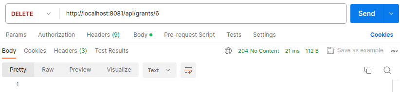

# Тестування працездатності системи

Для тестування системи використовувся Postman

Був реалізований доступ до наступних таблиць: **Role**, **Grant**, **Permission**

## Spring Application Startup Log

    

## Початкове наповнення бази даних

    

## Role

### Get (All)

    

### Post

    

### Get/Id

    

###  Put

    

###  Delete

    

## Permission

### Get (All)

    

### Post

    

### Get/Id

    

###  Put

    

###  Delete

    

## Grant

### Get (All)

    

    

### Post

    

### Get/Id

    

### Put

    

### Get/By-role/Id

    

### Get/By-permission/Id

    

### Delete

    

